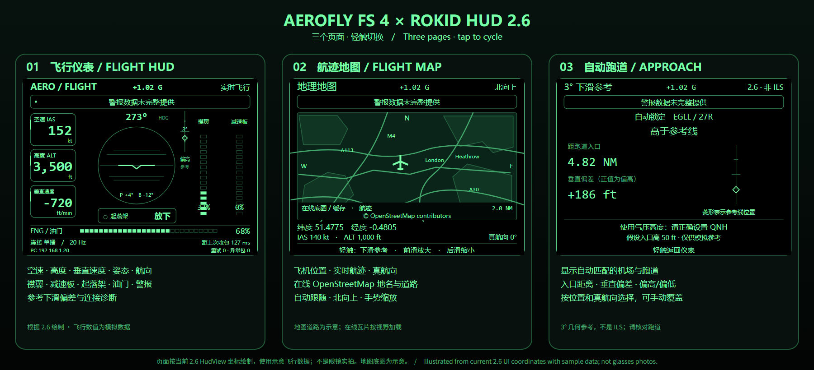

# Aerofly FS 4 × Rokid Flight HUD

[English](README.en.md)

## ⬇ 最新 2.6 自动跑道版（versionCode 29）

### [📦 下载完整包 / Download complete bundle](https://github.com/sjkxciuciu/aerofly-rokid-hud/raw/refs/heads/main/release/AeroflyRokidHud-2.6-AutoRunway-Bilingual.zip)

[中文 APK](https://github.com/sjkxciuciu/aerofly-rokid-hud/raw/refs/heads/main/release/AeroflyRokidHud-2.6-AutoRunway-Chinese.apk) · [English APK](https://github.com/sjkxciuciu/aerofly-rokid-hud/raw/refs/heads/main/release/AeroflyRokidHud-2.6-AutoRunway-English.apk) · [DLL](https://github.com/sjkxciuciu/aerofly-rokid-hud/raw/refs/heads/main/release/AeroflyRokidHud.dll) · [跑道数据库 DAT（必需）](https://github.com/sjkxciuciu/aerofly-rokid-hud/raw/refs/heads/main/release/AeroflyRokidRunways.dat)

**备用设置工具：** [CMD 设置工具](https://github.com/sjkxciuciu/aerofly-rokid-hud/raw/refs/heads/main/release/Set-ReferenceRunway.cmd) + [配套 PS1](https://github.com/sjkxciuciu/aerofly-rokid-hud/raw/refs/heads/main/release/Set-ReferenceRunway.ps1)（必须同目录）
**飞行记录：** [打开电脑记录文件夹 CMD](release/Open-FlightRecords.cmd) · [记录说明](release/2.6-FlightRecorder说明.txt)。记录保存在电脑 external_dll\flight-records，每秒写入 CSV；更新完整包中的新版 DLL 后，启动游戏飞行即可自动记录。

已启用自动模式时，日常使用无需打开此工具；仅在首次启用自动模式、自动选错跑道需手动指定，或关闭/恢复参考功能时使用。

### [📖 安装与自动跑道教程](docs/TUTORIAL-2.6.zh-CN.md)

**升级必须同时更换 APK、DLL，并安装跑道数据库。** 原始 2.6 / G 版 DLL 不适用于自动跑道功能。中英文 APK 二选一，互相覆盖安装。

[校验值](release/SHA256SUMS.txt) · [开发时说明及测试范围](release/2.6-AutoRunway说明.txt)

## 功能与限制

- 左右展开的大字绿色 HUD：空速、高度、垂直速度、水平仪、航向、起落架、襟翼、减速板、警报、连接诊断和油门比例。
- 仪表、地图、3° 参考页常驻 G 值；缺少有效数据时显示不可用，不填充默认值。
- 地图含在线底图与航迹；仪表局域网传输和自动跑道选择不依赖互联网，在线底图需要联网。
- 自动跑道根据飞机位置、真航向及入口匹配，不读取 FMS，不代表 ATC 指定跑道。平行跑道可能选错，必须核对名称。
- 下滑参考假设 3°、入口上方 50 ft，**不是 ILS**；正确设置 QNH，仅供模拟游戏。
- 油门比例不是实际发动机推力或 N1；起落架为整体位置，不表示各支柱独立锁定。

## 快速安装

1. 完全退出 Aerofly FS 4，解压完整包。
2. Windows + R 输入 `shell:Personal`，将 **AeroflyRokidHud.dll 和 AeroflyRokidRunways.dat** 放进文档下的 `Aerofly FS 4\external_dll`，不是 Steam 游戏目录。
3. 在眼镜覆盖安装一个语言 APK（Android 7.0 / API 24 或以上）。例如：
   `adb install -r AeroflyRokidHud-2.6-AutoRunway-Chinese.apk`
4. 双击 CMD，点击 **Automatic runway selection** 启用自动模式；下载本身不会自动替你配置电脑。
5. 电脑和眼镜接入可互通的局域网，重启游戏进入飞行，再打开 HUD。轻触切换仪表 → 地图 → 参考页；地图前后滑动缩放。

CMD 必须与 PS1 同目录。保留原配置可继续手动模式；Save / Enable 指定手动跑道，Disable reference 关闭参考。

## 网络与故障排查

电脑接收 UDP 49003，眼镜接收 UDP 49002。允许游戏在可信专用网络通信；访客 Wi-Fi、客户端隔离或广播过滤可能阻止发现。不要关闭整个防火墙。UDP 未加密、无身份认证，只用于可信局域网。

找不到电脑：检查 DLL 位置、游戏重启和网络。自动参考不可用：检查 DAT、启用自动模式、有效飞行数据和进近位置；候选需稳定约 3 秒，远离进近区域时不可用属正常。具体见教程。

## 验证与预览

**2.5 已经实机验证（作者确认）；不等于本次 2.6 自动跑道更新已实机验证。** 新版已有本地 DLL/UDP、自动选择/锁定、回归测试及 Android 编译/lint 检查；发布说明记录尚未连接眼镜验证新功能。此次上传核对了 APK 版本、签名和整包文件一致性，不代表全部机型兼容。

上图按 2.6 当前界面坐标绘制，展示仪表、地图、自动跑道参考三个页面。数值为示意数据，不是眼镜实拍；地图道路为示意，在线底图会按飞机位置加载。

## 源码与历史版本

仓库原有源码、构建脚本和旧发布说明保留用于参考，**尚未同步到本次二进制版本，不保证可重建此发布包**。请以首页最新完整包和 2.6 教程为准；release 内旧 APK/ZIP 为历史产物。

[历史更新记录](CHANGELOG.md) · [历史 2.5 教程](docs/TUTORIAL-2.5.zh-CN.md) · [第三方声明](THIRD_PARTY_NOTICES.md)

非官方个人项目，与 IPACS、Rokid 无官方隶属关系。跑道数据库来源于 [OurAirports](https://ourairports.com/data/)，可能与游戏场景不同；在线地图使用 OpenStreetMap。仅供模拟游戏，不用于真实飞行。
