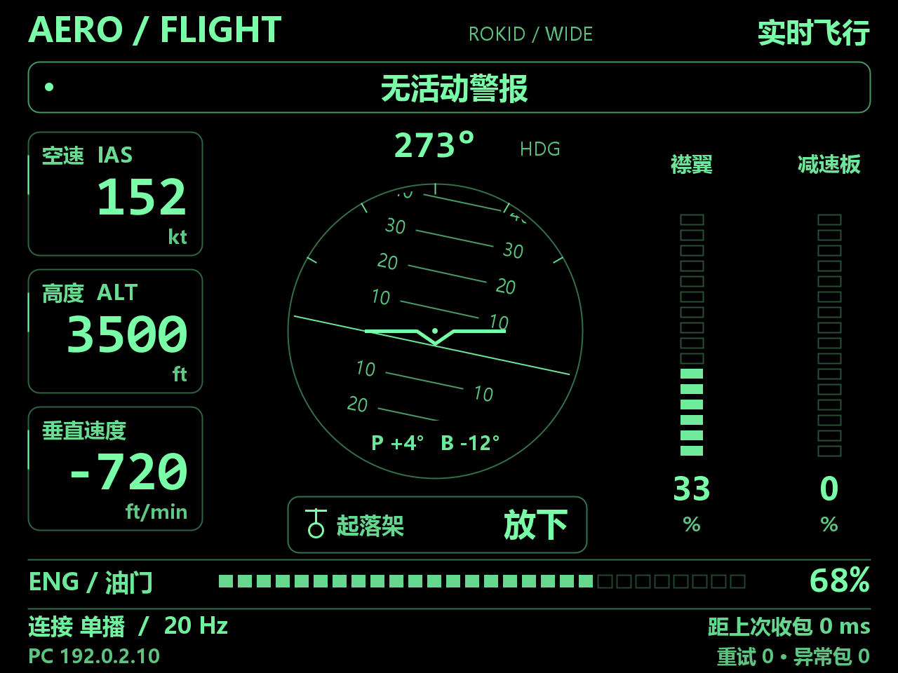

# Aerofly FS 4 × Rokid Flight HUD · 飞行仪表 HUD

**✅ 2.5 已经实机验证（作者确认）。**

## ⬇ 2.5 下载（点这里）

### [📦 推荐：完整安装包（中英文 APK＋DLL＋设置工具）](https://github.com/sjkxciuciu/aerofly-rokid-hud/raw/refs/heads/main/release/AeroflyRokidHud-2.5-Bilingual.zip)

### [📥 中文 APK](https://github.com/sjkxciuciu/aerofly-rokid-hud/raw/refs/heads/main/release/AeroflyRokidHud-2.5-Chinese.apk) · [📥 English APK](https://github.com/sjkxciuciu/aerofly-rokid-hud/raw/refs/heads/main/release/AeroflyRokidHud-2.5-English.apk) · [📥 电脑 DLL](https://github.com/sjkxciuciu/aerofly-rokid-hud/raw/refs/heads/main/release/AeroflyRokidHud.dll)

**跑道设置工具：** [下载 CMD](https://github.com/sjkxciuciu/aerofly-rokid-hud/raw/refs/heads/main/release/Set-ReferenceRunway.cmd) ＋ [配套 PS1（必须一起下载）](https://github.com/sjkxciuciu/aerofly-rokid-hud/raw/refs/heads/main/release/Set-ReferenceRunway.ps1)。解压后放在同一文件夹，双击 CMD。

### [📖 点这里看安装和跑道设置教程](docs/TUTORIAL-2.5.zh-CN.md)

本版必须同时更新 APK 和 DLL。中英文 APK 二选一，互相覆盖安装。新增的 3° 几何参考不是 ILS。[文件校验值](release/SHA256SUMS.txt)。

---

**简体中文** | [English](README.en.md)

把 Aerofly FS 4 的飞行仪表显示在带显示屏的 Rokid 眼镜上。

**横向宽屏 · 大字绿色 HUD · 中文警报 · 局域网实时传输**

项目包含 Windows C++ 外部 DLL 和 Android APK。电脑读取模拟器数据，通过同一局域网传到眼镜；日常使用不需要云端服务或手机转发。

这是个人开发的非官方项目，与 IPACS、Rokid 没有官方隶属关系。最新下载为 **中英文 APK 2.5 与配套 DLL 2.5**；下方介绍与预览原为 2.1.0 实验版整理；已完成构建、本机协议测试和布局预览检查；2.5 已经在作者的 Rokid 眼镜上实机验证。



上图通过实际 HudView 绘图代码及桌面 Canvas 适配层生成，使用模拟数值，**不是眼镜实拍截图**。

## 功能

| 区域 | 显示内容 |
| --- | --- |
| 左侧 | 指示空速 kt、高度 ft、垂直速度 ft/min |
| 中间 | 航向、俯仰/滚转水平仪、起落架整体状态 |
| 右侧 | 襟翼和减速板分段柱、百分比 |
| 顶部 | 飞行/连接状态、中文警报 |
| 底部 | 油门比例、传输模式、收包频率、距上次收包时间、重试及异常包计数 |

- 640×480 横向逻辑布局，大字体、绿色黑底；若眼镜固件仍提供竖屏窗口，自动采用 480×640 竖屏布局。
- 中文警报包括发动机火警、主警告、滑油/燃油/液压压力低、高度警报和注意。
- 起落架显示收起、过渡、放下或不可用；这是整体位置，不代表各支柱独立锁定情况。
- 飞行数据过期时显示“--”，缺失值不会被当作零或起落架收起。
- 自动发现电脑，登记后优先单播；已知电脑使用单播保活，断流后重试接收并重新发现。
- DLL 的网络心跳独立于游戏数据更新，可提示“电脑已连接，等待新飞行数据”。

**读数说明：** ENG / 油门读取 Aircraft.Throttle，是油门比例，不是实际发动机推力或 N1。“距上次收包”表示眼镜本机距最后有效数据包的时间，不是网络往返延迟。没有心跳时，单靠该协议无法判断是游戏关闭还是网络故障。

## 下载与安装

仓库提供当前构建产物：

- [Android APK](release/AeroflyRokidHud-debug.apk)
- [Windows x64 DLL](release/AeroflyRokidHud.dll)
- [SHA-256 校验值](release/SHA256SUMS.txt)

如果 GitHub 显示二进制预览页，点击 **Download raw file** 下载。

### 电脑端

1. 完全退出 Aerofly FS 4。
2. 将 DLL 放到 Windows“文档”目录下的：

   ```text
   Aerofly FS 4\external_dll\AeroflyRokidHud.dll
   ```

   没有 external_dll 文件夹时自行创建。此处是文档目录，不是 Steam 游戏安装目录。
3. 重新启动游戏并进入飞行。

### 眼镜端

目标设备是**带显示屏且支持安装兼容 Android APK 的 Rokid 眼镜**。APK 要求 Android 7.0 / API 24 或以上；不同型号和固件是否允许安装、横屏显示，仍需实机确认。

开启设备开发者模式和 ADB 后安装：

```powershell
adb install -r .\release\AeroflyRokidHud-debug.apk
```

打开 **Aerofly HUD**，让电脑和眼镜处于同一局域网。出现“实时飞行”表示收到了有效仪表数据。

当前 APK 使用开发调试签名。仓库不包含签名私钥；他人在自己电脑重新构建时，签名通常不同，不能直接覆盖已安装的原签名 APK。

## 网络与排障

| 端口 | 用途 |
| --- | --- |
| UDP 49002 | 眼镜接收仪表数据 |
| UDP 49003 | 电脑接收发现及登记消息 |

- Windows 防火墙需允许 Aerofly 在所用的可信专用网络通信。
- 同一个 Wi-Fi 名称并不保证设备可以互通；访客网络、客户端隔离或广播过滤可能阻止首次发现。
- 若无法发现电脑，可以让眼镜连接电脑热点后测试。
- 电脑收到登记后向眼镜单播数据，并保留低频广播；网络恢复时间取决于设备与网络状态，不保证固定秒数。
- UDP 协议没有身份认证或加密，只应在可信局域网使用。

| 屏幕提示 | 含义 |
| --- | --- |
| 实时飞行 | 电脑通信和主要飞行字段有效 |
| 等待游戏 | 电脑心跳正常，但主要飞行数据缺失或过期 |
| 寻找电脑 / 正在重连 | 尚未收到数据，或最近数据已超时 |
| 不可用 / -- | 对应字段没有提供有效的新数据 |

可先退出 Aerofly，再运行模拟发送脚本检查 HUD：

```powershell
.\Test-Hud-Stream.ps1 -Seconds 60
# 已知眼镜 IP 时也可以指定：
.\Test-Hud-Stream.ps1 -Target 192.168.1.50 -Seconds 60
```

模拟数据会标记“测试数据”。该脚本与 DLL 使用同一个发现端口，不要同时运行。

## 从源码构建

### DLL

需要 Windows、Visual Studio 2022 Build Tools、MSVC v143 和 Windows SDK：

```powershell
.\Build-Plugin.ps1
```

脚本下载 IPACS 官方 External DLL Sample 的头文件，构建 x64 DLL，输出到 release，并复制到当前用户文档目录的 Aerofly 外部插件文件夹。**执行前请退出游戏。**

### APK

需要可用的 JDK（本机使用 JDK 21），并允许构建工具访问网络：

```powershell
.\Build-Apk.ps1
```

脚本在 .build-cache 下载 Android SDK 与 Gradle，输出 release/AeroflyRokidHud-debug.apk。当前工具链为 Gradle 8.10.2、Android Gradle Plugin 8.8.2、compile/target SDK 35。

注意：现有脚本会自动接受 Android SDK 许可，使用前请自行阅读并确认相应许可。

## 项目结构

```text
aerofly-plugin/        C++ 只读数据桥接及官方 SDK 头文件
glasses-app/           Java Android 接收器、协议解析和 Canvas HUD
docs/                 布局预览
release/              当前 APK、DLL 和校验值
Build-Plugin.ps1       构建并安装电脑端 DLL
Build-Apk.ps1          构建 APK
Test-Hud-Stream.ps1    测试数据发送器
```

## 验证范围

已完成：C++ 编译、APK 构建与签名校验、本机 DLL 加载和 UDP 单播测试、单位换算、数据过期、重新登记及重初始化；Java 接收器的坏包、乱序包、30 次快速暂停/恢复、断流重绑、端口占用恢复；正常、警报和断流画面的桌面预览检查。

作者确认：2.5 已经实机验证。此结论针对作者使用的设备与环境，不代表已覆盖真实 Wi-Fi 切换、所有设备型号或所有飞机的字段与警报行为。游戏未提供的字段显示不可用。

## 版本与第三方材料

- [更新记录](CHANGELOG.md)
- [2.1.0 发布说明](RELEASE_NOTES.md)
- [第三方声明](THIRD_PARTY_NOTICES.md)
- [IPACS 官方开发者页面与 External DLL Sample](https://www.aerofly.com/developer/)

SDK 中 Aircraft.VerticalSpeed 的单位为 m/s，本项目换算为 ft/min；Aircraft.Gear 的 0/1/中间值分别表示收起、放下及过渡。项目只读取模拟器数据，不向游戏发送控制指令。
